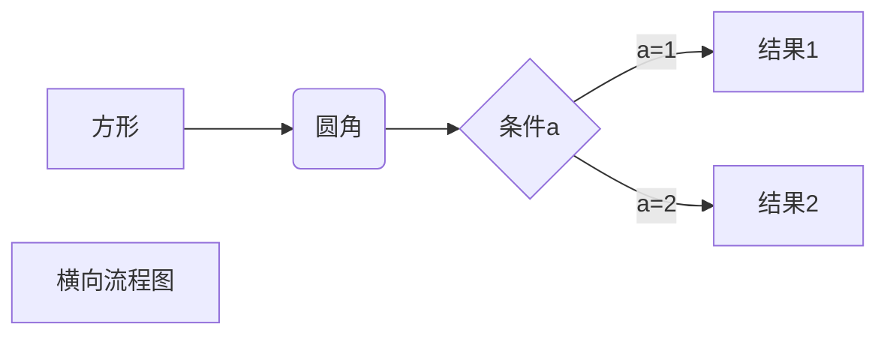
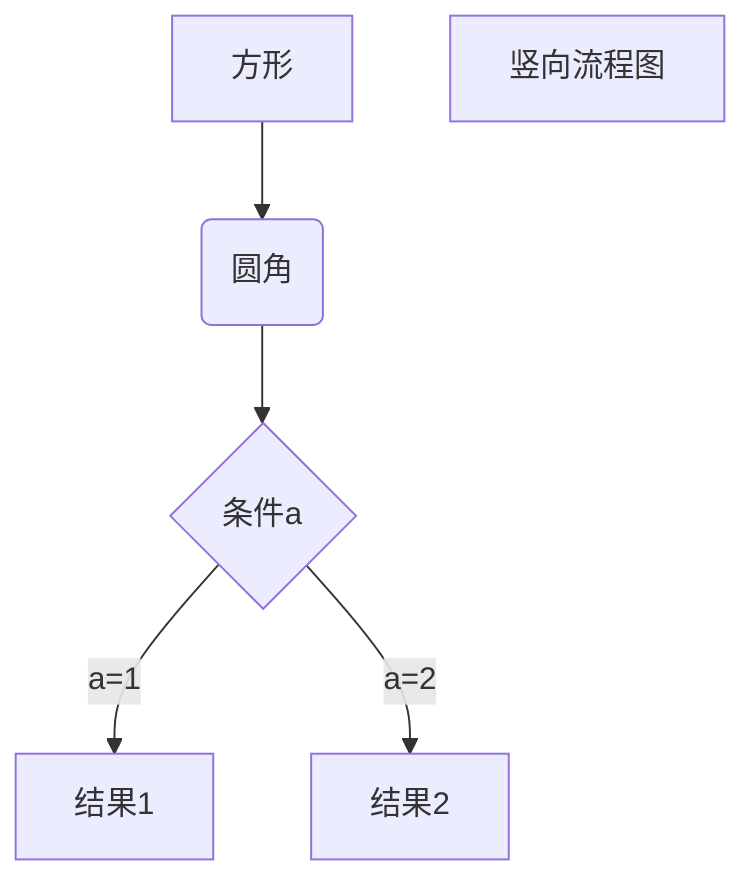
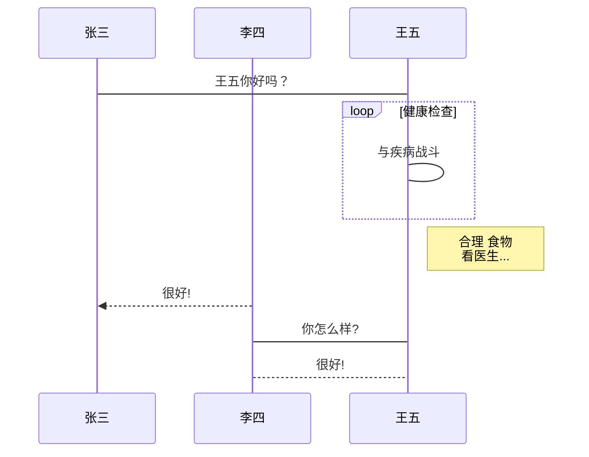
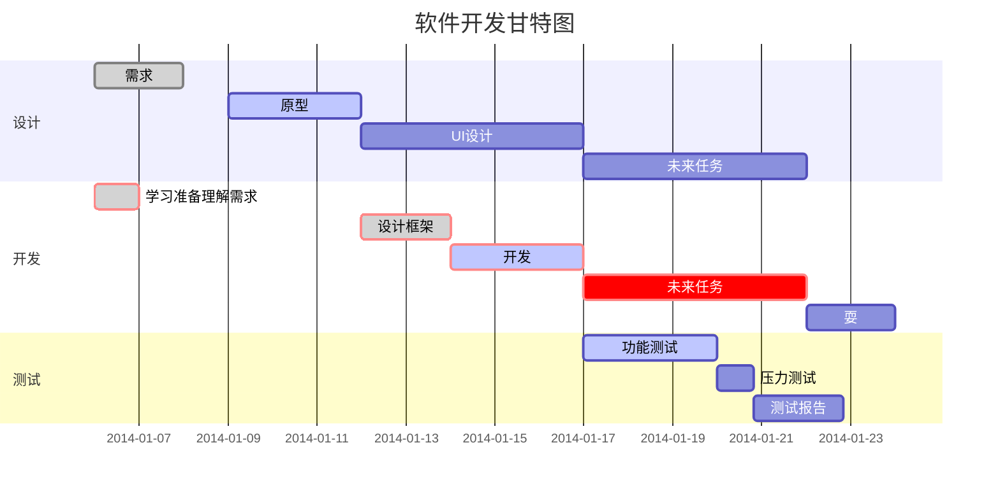

## Markdown是什么？

Markdown是一种轻量级标记语言，创始人为约翰·格鲁伯（英语：John Gruber）。 它允许人们使用易读易写的纯文本格式编写文档，然后转换成有效的XHTML（或者HTML）文档。这种语言吸收了很多在电子邮件中已有的纯文本标记的特性。


## 为什么要用Markdown

由于Markdown的轻量化、易读易写特性，并且对于图片，图表、数学式都有支持，目前许多网站都广泛使用Markdown来撰写帮助文档或是用于论坛上发表消息。 如GitHub、Reddit、Diaspora、Stack Exchange、OpenStreetMap 、SourceForge、简书等，甚至还能被使用来撰写电子书。我这边使用Markdown主要使用来发表在网站上发表博文。

---

## 怎么使用Markdown

Markdown是一门标记语言，有他自有的一些标记方式。主要有标题、段落、列表、区块、代码、链接、图片、表格以及其他一些技巧。

---

### 标题

标题使用“#”号加空格来标记。“#”的数量来表示1~6级的标题。

例如：

```
# 一级标题
## 二级标题
### 三级标题
#### 四级标题
##### 五级标题
###### 六级标题
```

显示效果：

># 一级标题
>## 二级标题
>### 三级标题
>#### 四级标题
>##### 五级标题
>###### 六级标题

如果只用一级标题以及耳机标题也可使用一个或多个“=”来标记一级标题。“-”来标记二级标题。但是需要标记符号需要在文本的紧接的下一行。
例如：
	一级标题
	=======
	二级标题
	-------
标记效果：
>一级标题
>=======
>二级标题
>-------
---

### 字体以及段落

#### 段落

直接使用回车进行换行，求换段落可在末尾加两个空格再进行回车。也可使用空行来换段落。

---

#### 字体

Markdown有粗体、斜体、粗斜体等几种字体样式。
斜体使用两个`*`号或者`_`将文本包起来。
粗体使用三个`*`号或者`_`将文本包起来。
粗斜体使用三个`*`号或者`_`将文本包起来。

例如

```
*斜体字体*
**粗体字体**
***粗斜体字体***
_斜体字体_
__粗体字体__
___粗斜体字体___
```

效果:

> *斜体字体*
> **粗体字体**
> ***粗斜体字体***
> _斜体字体_
> __粗体字体__
> ___粗斜体字体___

---

#### 分隔线

在空行使用连续的三个`*`或者连续三个`-`建立分割线。该行不能用其他东西。

例如：

```
***
---
```

效果：

> `***`
> ***
> `---`
> ---
>
> ---
>
> 

---

#### 删除线

在需要加上删除线的文字两端加上两个`~`即可添加删除线。

例如：

`~~删除线~~`

效果：

> ~~删除线~~


---

#### 下划线

可使用html下划线标签`<u>`来获得下划线效果。

例如：

`<u>下划线</u>`

效果：

> <u>下划线</u>

---

#### 脚注

脚注的目的是对文本进行补充说明。

使用`[^要注明的文本]:注明的内容`这种格式进行标注。当然鼠标滑过文本是会显示注记的内容。

效果如下：

> [^要注明的文本]:嘿嘿嘿 --注明的内容

---

### 列表

列表显示
列表有两种一种是无序列表一种是有序列表。

无序列表在文本前面加上星号`*`加号`+`减号`-`标记无序列表

例如：

```
*第一项
*第二项
*第三项
*·······

+第一项
+第二项
+第三项
+·······

-第一项
-第二项
-第三项
-·······
```


效果：

>* 第一项
>* 第二项
>* 第三项
>* ······

> + 第一项
> + 第二项
> + 第三项
> + ······

> - 第一项
> - 第二项
> - 第三项
> - ······

无序列表使用数字加上`.`来标记有序列表项

例如：

```
1.第一项
2.第二项
3.第三项
```

效果：

> 1.第一项
>
> 2.第二项
>
> 3.第三项

### 区块

Markdown 区块引用是在段落开头使用 **>** 符号 ，然后后面紧跟一个空格符号：、

### 代码

如果是段落上的一个函数或片段的代码可以用反引号把它包起来（**`**）

### 链接

写完文章时我常常会使用都链接

链接常用`[链接名称](链接地址)`或者`<链接地址>`

例如：

```
[链接名称](链接地址)

或者

<http.xxx.com>
```

效果：

>[链接名称](链接地址)
>
>或者
>
><http.xxx.com>

##### 高级链接

可以使用[变量]来链接地址.然后在文档末尾给变量赋值。就像下面这样。

```
设置变量
[链接名称][变量名]
赋值变量
[变量名]：www.xxxxxx.com
```

### 图片

图片格式跟链接基本相似。在链接`[链接名称](链接地址)`前加上一个感叹号`！`即为``

图片也可跟链接一样使用变量赋值的方式来插入图片。

### 表格

制作表格使用 **|** 来分隔不同的单元格，使用 **-** 来分隔表头和其他行。

例如：

```
|  表头   | 表头  |
|  ----  | ----  |
| 单元格  | 单元格 |
| 单元格  | 单元格 |
```

效果：

>| 表头 | 表头 |
>| ---- | ---- |
>| 单元格 | 单元格 |
>| 单元格  | 单元格 |

**我们可以设置表格的对齐方式：**


- **-:** 设置内容和标题栏居右对齐。
- **:-** 设置内容和标题栏居左对齐。
- **:-:** 设置内容和标题栏居中对齐。

例如：

```
| 左对齐   | 居中   |右对齐|
| ：------ | ：------ ：|------： |
| 单元格 | 单元格 |单元格 |
| 单元格 | 单元格 |单元格 |
```
效果：
>| 左对齐   | 居中   |右对齐|
| :------ | :-------: | ------: |
| 单元格 | 单元格 |单元格 |
| 单元格 | 单元格 |单元格 |

### 其他技巧

#### 支持的 HTML 元素
不在 Markdown 涵盖范围之内的标签，都可以直接在文档里面用 HTML 撰写。
目前支持的 HTML 元素有：<kbd> <b> <i> <em> <sup> <sub> <br>等
#### 转义
Markdown 使用了很多特殊符号来表示特定的意义，如果需要显示特定的符号则需要使用转义字符，Markdown 使用反斜杠转义特殊字符：
例如：\**sdf**

Markdown 支持以下这些符号前面加上反斜杠来帮助插入普通的符号：

```
\   反斜线
`   反引号
*   星号
_   下划线
{}  花括号
[]  方括号
()  小括号
#   井字号
+   加号
-   减号
.   英文句点
!   感叹号
```

#### 公式

当你需要在编辑器中插入数学公式时，可以使用两个美元符 $$ 包裹 TeX 或 LaTeX 格式的数学公式来实现。提交后，问答和文章页会根据需要加载 Mathjax 对数学公式进行渲染

例如：

```
$$
\mathbf{V}_1 \times \mathbf{V}_2 =  \begin{vmatrix} 
\mathbf{i} & \mathbf{j} & \mathbf{k} \\
\frac{\partial X}{\partial u} &  \frac{\partial Y}{\partial u} & 0 \\
\frac{\partial X}{\partial v} &  \frac{\partial Y}{\partial v} & 0 \\
\end{vmatrix}
${$tep1}{\style{visibility:hidden}{(x+1)(x+1)}}
$$
```


效果：

>$$
>\mathbf{V}_1 \times \mathbf{V}_2 =  \begin{vmatrix} 
>\mathbf{i} & \mathbf{j} & \mathbf{k} \\
>\frac{\partial X}{\partial u} &  \frac{\partial Y}{\partial u} & 0 \\
>\frac{\partial X}{\partial v} &  \frac{\partial Y}{\partial v} & 0 \\
>\end{vmatrix}
>${$tep1}{\style{visibility:hidden}{(x+1)(x+1)}}
>$$

### Typora 画流程图、时序图(顺序图)、甘特图应用案例效果图

1、横向流程图源码格式：


2、竖向流程图源码格式：


3、标准流程图源码格式：
```flow
st=>start: 开始框
op=>operation: 处理框
cond=>condition: 判断框(是或否?)
sub1=>subroutine: 子流程
io=>inputoutput: 输入输出框
e=>end: 结束框
st->op->cond
cond(yes)->io->e
cond(no)->sub1(right)->op
```
4、标准流程图源码格式（横向）：
```flow
st=>start: 开始框
op=>operation: 处理框
cond=>condition: 判断框(是或否?)
sub1=>subroutine: 子流程
io=>inputoutput: 输入输出框
e=>end: 结束框
st(right)->op(right)->cond
cond(yes)->io(bottom)->e
cond(no)->sub1(right)->op
```
5、UML时序图源码样例：
```sequence
对象A->对象B: 对象B你好吗?（请求）
Note right of 对象B: 对象B的描述
Note left of 对象A: 对象A的描述(提示)
对象B-->对象A: 我很好(响应)
对象A->对象B: 你真的好吗？
```
6、UML时序图源码复杂样例：
```sequence
Title: 标题：复杂使用
对象A->对象B: 对象B你好吗?（请求）
Note right of 对象B: 对象B的描述
Note left of 对象A: 对象A的描述(提示)
对象B-->对象A: 我很好(响应)
对象B->小三: 你好吗
小三-->>对象A: 对象B找我了
对象A->对象B: 你真的好吗？
Note over 小三,对象B: 我们是朋友
participant C
Note right of C: 没人陪我玩
```
7、UML标准时序图样例：

8、甘特图样例：
